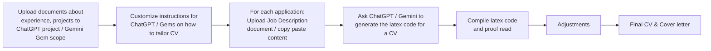
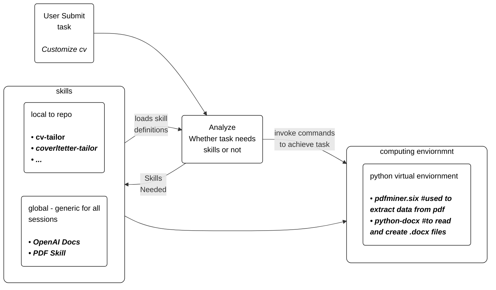

Simon Wilson [predicted that skills will be a bigger deal than MCP](https://simonwillison.net/2025/Oct/16/claude-skills/) s five months ago ! With agent skills, the coding CLI s had been given the ability to become more generic agents. <br>

Meantime, I was in the midst of changing jobs and migration and in the lookout for new opportunities in a different country. <br>

I've been using Chatgpt projects, Gemini Gems to customize my resume to suite different roles. A project or gem has a context determined by the files, instructions you give and you can call that specialized project to continue work , such as tailoring a CV for a new job description based on your past experience. The approach has worked well and I assume, many people use chatgpt or gemini like that. <br>

Also, in the meantime, I came across a great comprehensive open source project called [AI-Hawlk _29k github stars_](https://github.com/feder-cr/Jobs_Applier_AI_Agent_AIHawk) that can generate CVs in bulk, given a URL of a job posting. I tried to use it, but it require following a certain framework, which needed some time to setup. <br>

I was also facinated by the power of latex and how latex compiled pdf s (including CV s) look professional. It would be really hard to match the styles and typesetting with a word processing software. So I decided to ask ChatGPT & Gemini to customize CV and generate a latex code, which should be compiled to generate a CV. <br>

My simple planned workflow was ; 


<br>

Thus I used codex to build a streamlit app that can intake a latex code and generate a PDF. <br>

Actually, my first option was to build this as a browser based app. I tried ChatGPT canvas ( with 5.1), Gemini Canvas ( 3 pro), Claude artefacts & Google AI Studio's app builder ( 3 pro) at the same time. To my great surprise none of them worked. It appears that setting up the latex to pdf conversion on browser has complicated dependencies on a Canvas like web app ( from downloading and using them browser runtime ). After spending some time on this, I realised it'd be better off to spend time on creating the app as a streamlit than taking a web development 101 course. To make the app available on the go, I used github codespaces as a runtime, which worked pretty well. [Credit to Simon agan !](https://simonwillison.net/tags/github-codespaces/) <br>
The app interface looks like below ; <br>


<br>
### How to get started
In basic, skills are simply instructions that you give to carryout a specific task to AI Agent.<br>
It is similar to a Custom GPT, Gemini GEM where you set the context by uploading files, giving specific instructions for a curated output. Compared to MCPs or tool calls skills are supposed to use less tokens as agent can retrieve skill info on the fly by reading skills.md. Only the skill metadata is known to agent upfront.

Good news is that, there are skill creators ! Very similar to how you meta prompt to create a desired prompt, there is a meta skill to create a specific skill. <br>

In Codex <br>
go to /skills

```text
/skills  use skills to improve how Codex performs specific tasks
```

enter

```text
1. List skills            Tip: press $ to open this list directly.
2. Enable/Disable Skills  Enable or disable skills.
```

For the first time when you go to 2. Enable/Disable Skills, you'd see <br>

```text
[x] Skill Creator    Create or update a skill
[ ] Skill Installer  Install curated skills from openai/skills or other repos
```

If you want to create a skill ( like tailoring a cv, choose 'Skill Creator' ). It is pretty intuitive and easy to create when you articulate it clearly ( pretty much prompt engineering ) <br>

OpenAI provides a skill library that you can choose and install from. 

in codex prompt type _$skill-installer_ which is another skill. The output looks like below<br>

```text
I’m using the skill-installer skill. Its list-skills.py script needs network access, and this environment won’t allow me to run it 
  with escalation.

  Please run this command locally and paste the output here:

  python "C:\Users\DELL\.codex\skills\.system\skill-installer\scripts\list-skills.py"
```

  Then tell Codex which skills you want installed. In my case I wanted Codex to read PDFs, .docx etc. So I installed _PDF_ skill from the default skillset.

If your Agent wants to read PDFs, create PDFs , .docx etc.. then. Example for PDF processing skills <br>
```text
  OpenAI Docs      Reference the official OpenAI Developer docs
  PDF Skill        Create, edit, and review PDFs
``` 

I'll now explain my project structure for cv customization which will help me to explain the skill specification more clearly. <br>

### Project Structure for CV customization

This is how my repo looks now. _by the time I'm writing this section, I've added coverletter customization skill, which wasn't part of original plan_ <br>


```text
cv-customization/             # root folder
├── data_folder/              # reference data folder
│   ├── coverletter_dtls/     # cover letter specific requirements (depending on some employer requirement)
│   ├── coverletter_output/   # cover letter output folder
│   ├── experience/           # different documents with your experience with career chapters. In .docx .md .pdf
│   ├── jobdescriptions/      # job advertisments .pdf .docx .html .md .txt etc
│   └── references/           # reference cv template in latex (.tex) form
├── latex/                    # cv output folder in .tex form 
├── scripts/                  # some utility scripts I use to install latex to pdf conversions. used for env setup / portability only
├── skills_local/             # project specific local skills
│   ├── coverletter-tailor/   # skill for coverletter tailoring
│   └── cv-tailor/            # skill for cv tailoring
├── streamlitapps/            # my streamlit app to compile latex and generate PDF & proof read
└── venvev/                   # python virtual env

```

So you get the idea ; it is upto you and me to customize the repo as matching to our needs <br>

### Anatomy of skill specification

A skill specification is easy to understand, very much a prompt. It's in markdown form. <br>

__Skills have context__ ; whether they are globally relevant across all Codex sessions or locally available for a specific repo / task. <br>
The idea is simple ; you don't need _cv-tailor_ skill for a repository/project you have, to analyze data with custom instructions, schema to produce a ppt summary. <br>

Lets look at the skill definition, I use to customize CV. <br>
__Below was created using Codex's _skill-creator_ skill__. I only validated and tweaked. _I've redacted some personal and unwanted information_ <br>

```markdown
---
name: cv-tailor
description: Customize a LaTeX CV for this repository based on a job description file in jobdescriptions/ and experience sources in experience/. Use when asked to tailor a CV to a specific role; inputs may be .pdf/.html/.md/.txt for the job description and .pdf/.docx for experience. Output must be LaTeX written to latex/ using latex/<cv_name>.tex as the default template unless another template is specified.
---

# Cv Tailor

## Overview

Create a tailored LaTeX CV for a specific job description using the default template and the local experience library. Keep content truthful, concise, and aligned with the role requirements.

## Workflow

1. Confirm inputs and output name
- Always ask for: (1) job description file path under jobdescriptions/, (2) reference CV LaTeX template (default: latex/<reference cv>.tex).
- Ask for experience file paths under experience/ only if the user does not say "use all" (default: use all).
- If the user did not provide an output filename, default to latex/<job_basename>_tailored_cv.tex. If that file exists, append _v2, _v3, etc.

2. Load the job description text
- .txt or .md: read as plain text.
- .html: extract visible text and ignore scripts/styles/navigation.
- .pdf: extract text with pdfminer.six; if extraction is poor, ask the user for a text export.

3. Load experience sources
- .pdf: extract text with pdfminer.six.
- .docx: attempt extraction only if a local parser is available; otherwise ask the user to provide a text or PDF export.

4. Derive the targeting signals
- Identify the top required skills, tools, and responsibilities.
- Map each requirement to the strongest matching experiences and achievements.
- Select only substantiated claims from the source material.

5. Tailor the LaTeX CV
- Use latex/<reference cv>.tex as the base template unless the user specifies another template.
- Preserve the template structure, macros, and formatting.
- Update summary, skills, and experience bullet points to emphasize the role fit.
- Keep wording tight and metrics-forward where evidence exists.

6. Produce outputs
- Write the full LaTeX document to the target file under latex/.
- Return the full LaTeX content in the response so the user can render and proofread.

## Guardrails

- Do not invent experience, credentials, or metrics.
- If required information is missing, ask targeted questions rather than guessing.
- Keep changes limited to content sections; avoid altering layout or LaTeX preamble unless explicitly asked.

```

In simple form , skills are some definitive guidelines how the AI Agent should go about the task.
For skills to work, the Agent should have access to a computing enviorment. I'll explain my enviornment where the agent work.

