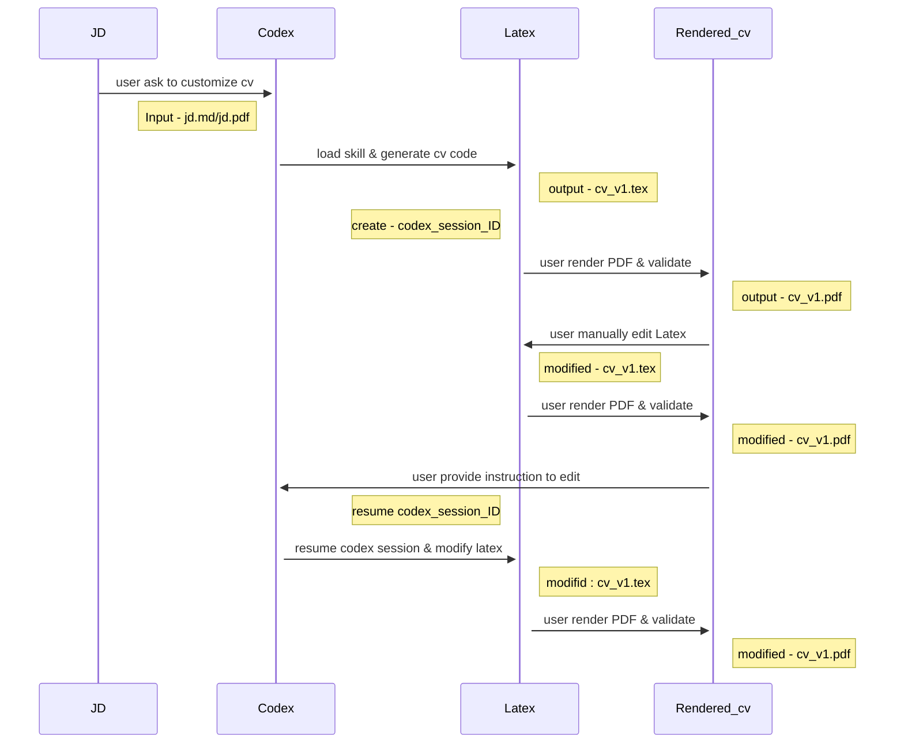

__This is a continuation of my previous writeup of using [Agentic Skills](https://nilanka-weeraman.github.io/configuring_using_agent_skills/) ___ 

I had setup a workflow to tailor CV s with Codex & Streamlit ( on python virtual env ). It was working smoothly. 
Whenever I wanted changes to a CV, I would; 
- manually alter the latex code
- ask codex to change specific parts of the cv by providing section, subsection information. 

The only problem is that, I've to the prompting & validation in two interfaces in above setup.
- manual alteration - entirely carried out in Streamlit app
- custom instructions - first I prompt in Codex cli then rendered output in streamlit app. 

I thought of enhancing current streamlit app and use Codex in the background. A crude Application with Agentic backend, without an orchestrator like Langchain. 
While developing this feature , I got the chance to explore what is happening under-the-hood in Codex.   
Efficient wise this is not good as it consumes lot of tokens , as Codex is a general agent. Other complications such as permission / sandboxing needs to be carefully thought of. The advantage of using langchain would be to be efficient and fast. However I still think that using Codex ( with skills & compute env ) will get the MVP version of the app much faster. Once you settle with app features, the agent workflow could be converted to a langchain like workflow implmentation. That is something I'll be trying next.  

Now my interactin sequence looks like below  

