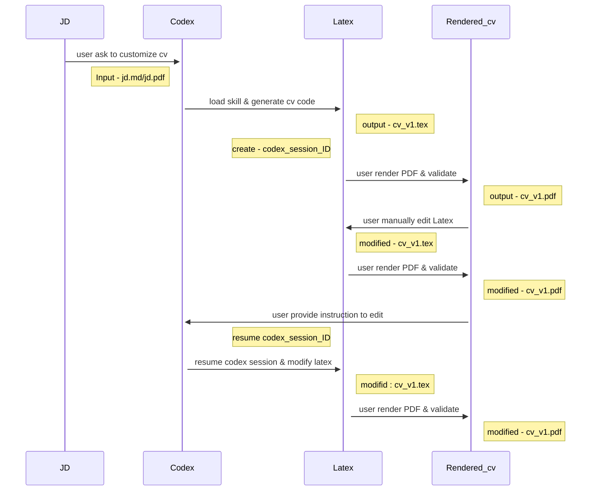

__This is a continuation of my previous writeup of using [Agentic Skills](https://nilanka-weeraman.github.io/configuring_using_agent_skills/)__<br>

I had setup a workflow to tailor CV s with Codex & Streamlit ( on python virtual env ). It was working smoothly.<br>
Whenever I wanted changes to a CV, I would;<br>
- manually alter the latex code
- ask codex to change specific parts of the cv by providing section, subsection information.<br>

The only problem is that, I've to the prompting & validation in two interfaces in above setup.
- manual alteration - entirely carried out in Streamlit app
- custom instructions - first I prompt in Codex cli then rendered output in streamlit app.<br>

I thought of enhancing current streamlit app and use Codex in the background. A crude Application with Agentic backend, without an orchestrator like Langchain.<br>
While developing this feature , I got the chance to explore what is happening under-the-hood in Codex. <br> 
Efficient wise this is not good as it consumes lot of tokens , as Codex is a general agent. Other complications such as permission / sandboxing needs to be carefully thought of. The advantage of using langchain would be to be efficient and fast. However I still think that using Codex ( with skills & compute env ) will get the MVP version of the app much faster. Once you settle with app features, the agent workflow could be converted to a langchain like workflow implmentation. That is something I'll be trying next. <br>

Now my interactin sequence looks like below <br>



Now my app has an interface where I could provide all tailoring instructions. <br>
I had to see the prompt / instruction sent to Codex as I faced some issues while development.<br>


The same interface supports text selection based edits. ie. I can select a part of the PDF and give specific instructions , such as ; make it more specific citing experience OR add quantitative outcome data. Codex is able to accurately follow these instructions and carryout edits. <br>


The underlying prompt structure is ; <br>

```markdown
carry out modifications to latex/[ cv file being reviewed ].tex. Edit instructions are ; [ Include additional sections covering
(1) Publications
(2) Other related intiatives ]
JD context path: data_folder/jobdescriptions/[ JD of the position ].md
Apply edits directly to the target file only.
Preserve factual accuracy and stable LaTeX structure.
If no selected text is provided and the instruction is ambiguous (for example: 'this section' / 'move this'), do not modify files. Ask for explicit target text.
```

I find that text search employed by the Codex is very accurate. Under the hood it only uses regular expression based text search. The text is determined by the LLM / Agent with similar semantic meaning to the query. <br>

This is a very interesting area and I'm going to compare how effective is this search against a vector DB based RAG. <br>

So that's how I ended up creating a toy app, that I think has a big potential / add-on to a website like LikedIn or Seek to tailor CVs , coverletters based on candidate's project history. The differentiator would be how much control such interface give the candidate to customize overall structure, specific text sections. <br>

This is relatively easy for you to try out with any coding agent in your PC. I will be releasing the git repo once I clean it up a bit. <br>